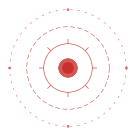
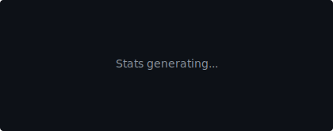
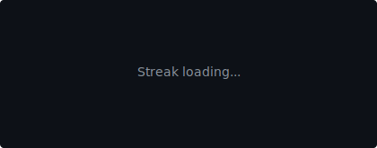

<div align="center">



<br/>
<br/>
<br/>


<br/>
<br/>
<br/>
<br/>

```
▓▓▓▓▓▓▓▓▓▓▓▓▓▓▓▓▓▓▓▓▓▓▓▓▓▓▓▓▓▓▓▓▓▓▓▓▓▓▓▓▓▓▓▓▓▓▓▓▓▓▓▓▓▓▓▓▓▓▓▓▓▓▓
░                                                               ░
░                      A L M O S T I D L E                      ░
░                                                               ░
▓▓▓▓▓▓▓▓▓▓▓▓▓▓▓▓▓▓▓▓▓▓▓▓▓▓▓▓▓▓▓▓▓▓▓▓▓▓▓▓▓▓▓▓▓▓▓▓▓▓▓▓▓▓▓▓▓▓▓▓▓▓▓
```

<br/>

*Moving in silence. Building in shadows.*

<br/>
<br/>
<br/>
<br/>


<br/>
<br/>

### ⚔️ &nbsp; TECHNIQUES

<br/>



<br/>
<br/>

<table>
<tr>
<td align="center" width="140">

<br/><sub><b>JavaScript</b></sub>
</td>
<td align="center" width="140">

<br/><sub><b>TypeScript</b></sub>
</td>
<td align="center" width="140">

<br/><sub><b>Python</b></sub>
</td>
<td align="center" width="140">

<br/><sub><b>React</b></sub>
</td>
</tr>
<tr>
<td align="center" width="140">

<br/><sub><b>Node.js</b></sub>
</td>
<td align="center" width="140">

<br/><sub><b>Docker</b></sub>
</td>
<td align="center" width="140">

<br/><sub><b>Git</b></sub>
</td>
<td align="center" width="140">

<br/><sub><b>Linux</b></sub>
</td>
</tr>
</table>

<br/>
<br/>
<br/>
<br/>


<br/>
<br/>

### 📊 &nbsp; RECORDS

<br/>
<br/>



<br/>
<br/>



<br/>
<br/>
<br/>
<br/>


<br/>
<br/>
<br/>


<br/>
<br/>

```
The work continues.
```

<br/>
<br/>


<br/>
<br/>

---

<br/>

<sub>*"Those who break the rules are scum. But those who abandon their comrades are worse than scum."*</sub>

<br/>

</div>
